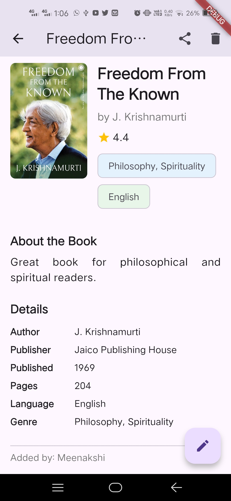
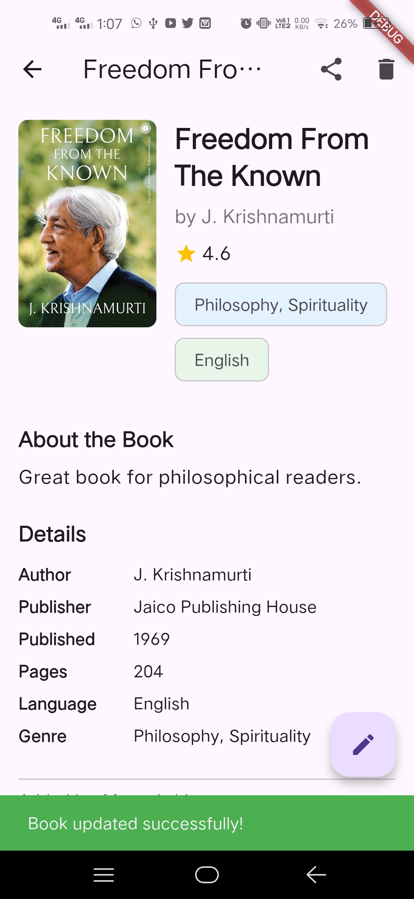

# bookstoreapp

Book Store applicaition with CRUD operations.

Scroll for screenshots.

## Getting Started

This project is a starting point for a Flutter application.

A few resources to get you started if this is your first Flutter project:

- [Lab: Write your first Flutter app](https://docs.flutter.dev/get-started/codelab)
- [Cookbook: Useful Flutter samples](https://docs.flutter.dev/cookbook)

For help getting started with Flutter development, view the
[online documentation](https://docs.flutter.dev/), which offers tutorials,
samples, guidance on mobile development, and a full API reference.

### App Screenshots

#### All Books: Books Home Screen (getAllBooks)

### Add New Book Page (addBook)

  

### View Book: Book Details Screen (getBookById)

  

### Update Book: Book Update/Edit Page (updateBook)

  

### Share Book Options

### Adding New Book

### Success Response

### All Books Fetched and Shown on Home Screen

### View Newly Added Book

### Update Details

  
 

### Update Success Response

### Share Via Other Apps (WhatsApp) or Copy to Clipboard

